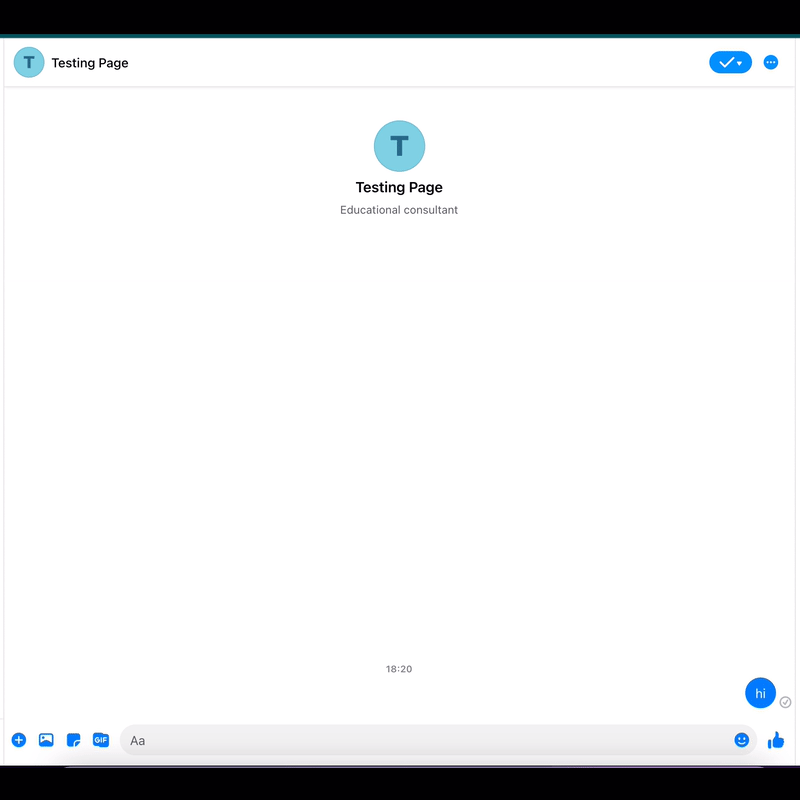

# Facebook NodeJS BOT
this programm is using NodeJS, testing using JEST and Supertest, and also dependencies that required such as request.

## Setup
to setting up this project, you just run npm install / npm i, and wait untill all programm installed.

## Testing
to test this code, just run npm run test

## How to Run
to run this project locally, you need some apps like Postman, or thunderclient in vscode extension, this is the url : 

GET /webhook

POST /webhook

But Facebook Messenger just accept Https (secure) protocols to running thier chat bot feature, so here I upload my code to Heroku, and this is a url :
https://adakerja-fb-chatbot.herokuapp.com/

## Result
This is result of my chatbot using NodeJS, Express and Facebook API.

